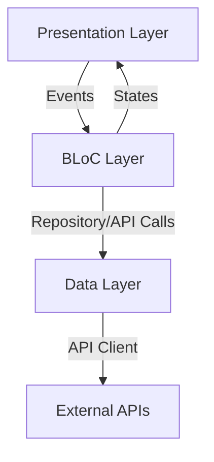

# 📰 NewsApp - Flutter-Powered News Aggregator

**A scalable, cross-platform news application following Clean Architecture principles**

[](https://flutter.dev)
[](https://bloclibrary.dev)
[](https://flutter.dev/multi-platform)

---

## 🎯 Project Highlights

✅ **Clean Architecture** with clear separation of concerns  
✅ **BLoC State Management** for predictable state transitions  
✅ **Full Cross-Platform** support (mobile, web, desktop)  
✅ **Modern UI** with responsive design  
✅ **Production-Ready** features like error handling and loading states  

---

## 📱 Feature Showcase

| Feature | Implementation Details |
|---------|----------------------|
| **Real-time News Feed** | REST API integration with pagination (via `http` package) |
| **Search** | Keyword-based search |
| **Responsive UI** | Adaptive layouts for all screen sizes, Google Fonts |
| **Loading Effects** | Shimmer-based skeleton screens |
| **External Links** | Open articles in browser (via `url_launcher`) |

---

## 🏗️ Technical Architecture



### Key Architectural Decisions:
1. **BLoC Pattern** for testable business logic (`flutter_bloc`)
2. **Separation of Concerns**: API helpers, constants, and models isolated in their folders
3. **Named Routing**: All navigation managed centrally via constants
4. **Error Handling** at UI and BLoC layers
5. **Theming**: Built-in Material theming, Google Fonts, and Cupertino Icons

---

## 🛠️ Tech Stack & Packages

| Package             | Usage                                      | Version    |
|---------------------|--------------------------------------------|------------|
| `flutter_bloc`      | State management (BLoC architecture)       | ^9.1.1     |
| `http`              | REST API requests to fetch news            | ^1.4.0     |
| `google_fonts`      | Modern font styling for UI                 | ^6.2.1     |
| `carousel_slider`   | Carousel for featured stories              | ^5.1.1     |
| `url_launcher`      | Open news articles in external browsers    | ^6.3.1     |
| `shimmer`           | Loading skeletons for content placeholders | ^3.0.0     |
| `cupertino_icons`   | iOS-style icons                            | ^1.0.8     |
| `flutter_lints`     | Recommended linting rules                  | ^5.0.0     |

---

## 🚀 Getting Started

### Prerequisites
- Flutter 3.8+
- Dart 3.8+
- News API key (e.g., from newsapi.org or similar)

### Quick Start
```bash
# 1. Clone repository
git clone https://github.com/cybersleuth0/NewsApp.git

# 2. Install dependencies
flutter pub get

# 3. Configure API endpoint & key
# Edit lib/AppConstant/constant.dart with your news API key

# 4. Run the app
flutter run
```

---

## 📂 Project Structure

```
lib/
├── Api_Helper/              # Network/API utilities
├── AppConstant/             # App-wide constants & route management
├── UI_Pages/                # Primary UI screens and pages
├── bloc/                    # BLoC files (state management)
├── models/                  # Data models for news, categories, etc.
└── main.dart                # App entry point, BLoC/routing setup
Assets/
└── Images/                  # App images, logos, and screenshots
```

---

## 📈 Future Roadmap

- [ ] Implement offline caching for articles
- [ ] Add user authentication and favorites
- [ ] Support dark/light themes and user preferences
- [ ] Improve accessibility and localization
- [ ] Expand test coverage (unit/widget tests)
- [ ] Add push notifications

---

## 🤝 Contribution Guidelines

We welcome contributions!

1. **Bug Reports** (GitHub Issues)
2. **Feature Requests** (Discussion Board)
3. **Code Contributions** (Pull Requests with tests)

---
